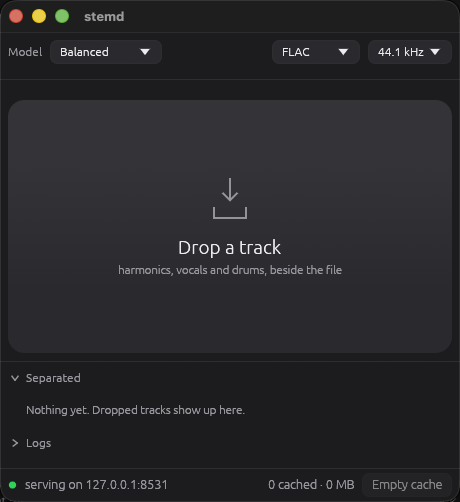

<div align="center">


# stemd

**Split any track into stems, on your own machine.**

Drop a file on the window. Get `harmonics`, `vocals` and `drums` in a folder
beside it.



[](#license)
[](#install)
[](#install)

</div>

---

## What you get

Three stems. In any lossless format the three files sum back to the original
track bit for bit.

| stem | contents |
| --- | --- |
| `vocals` | the voice |
| `drums` | the kit |
| `harmonics` | bass, keys, guitars, pads |

## Requirements

| | |
| --- | --- |
| macOS | 14 or later, Apple silicon |
| Windows | NVIDIA card and driver 580 or later, else CPU |
| Linux | Debian 13 or Ubuntu 24.04, NVIDIA card, driver 580 or later |
| disk | 168 MB to 942 MB of model weights, downloaded on first run |

## Install

**macOS.** Open the `macos-arm64` disk image from the
[latest release](https://github.com/nsaintot/stemd/releases/latest) and drag
stemd to Applications. Signed and notarized, and the ticket is stapled to the
app as well as to the image, so it opens without argument and the first launch
does not need a network.

**Windows.** Run the `setup.exe` from the same page. It installs for you
alone by default and asks for no administrator; the first page offers all users
instead. There is a zip beside it for anyone who would rather not run an
installer.

On a machine with an NVIDIA card, tick the box at the end of the installer or run
`install-cuda.cmd` once afterwards: about 1.2 GB of NVIDIA's own runtime, fetched
once and pinned by digest. No toolkit and no repository. Without it stemd runs on
the CPU, correctly and far slower.

**Linux.** Take the `amd64.deb` from the
[latest release](https://github.com/nsaintot/stemd/releases/latest). It wants
the CUDA 13 runtime and cuDNN 9.5 or later, both from
[NVIDIA's own repositories](https://developer.download.nvidia.com/compute/cuda/repos/),
so add those first.

```bash
sudo apt install ./stemd_*_amd64.deb
```

Debian 13 takes one more step. NVIDIA publish no cuDNN package for it yet, so
that dependency cannot resolve from any repository: install cuDNN 9.5 or later by
hand, point the linker at it, and install without that one dependency. Miss the
linker line and the window opens, reports `device: gpu`, and fails every
separation.

```bash
echo /opt/cudnn13/lib | sudo tee /etc/ld.so.conf.d/cudnn.conf
sudo ldconfig
sudo dpkg -i --force-depends ./stemd_*_amd64.deb
```

## Use it

Drop a track on the window, or click to choose one. The stems appear in
`<track>-stems/` next to the original.

### From another machine

stemd is also a server. It announces itself over mDNS, so a client does not need
to be told an address, and it speaks plain HTTP:

```bash
stemd-cli path/to/track.wav
```

`--headless` runs it without a window. The HTTP contract is in
[docs/api.md](docs/api.md).

## Presets

| preset | model | download |
| --- | --- | --- |
| **Fast** | `htdemucs` v4 | 168 MB |
| Balanced | `htdemucs_ft` | 672 MB |
| Quality | BS PolarFormer + `htdemucs_ft` | 102 MB plus the above |

Measured on a 64 s clip, warm, against a 6:38 track on an M1 Pro:

| preset | RTX 3090 Ti | M1 Pro |
| --- | --- | --- |
| **Fast** | 106x realtime | 18x realtime |
| Balanced | 55x | 8x |
| Quality | 10x | 1.6x |

The first separation after launch costs about twice the warm figure: the GPU
kernels are compiled on first use.

Fast is the default. It won a listening test on real material against the other
two; see [docs/evaluation.md](docs/evaluation.md).

## Where things go

| | |
| --- | --- |
| stems | `<track>-stems/`, beside the track |
| models | the user data directory, downloaded once |
| cache | recent results, capped at 4 GB, emptied at every start |

Repeating a track already separated returns the cached result: entries are keyed
by the audio and by everything else that changes the output.

## Build from source

Needs `cmake`, Rust 1.85 or later, and a recursive clone. Per-platform
toolchains, packaging and every flag are in
[docs/building.md](docs/building.md).

```bash
git clone --recurse-submodules https://github.com/nsaintot/stemd
cargo build --release
```

## Documentation

| | |
| --- | --- |
| [docs/building.md](docs/building.md) | building, packaging and every flag |
| [docs/api.md](docs/api.md) | the HTTP contract for writing a client |
| [docs/internals.md](docs/internals.md) | cache, queue, discovery, model loading |
| [docs/evaluation.md](docs/evaluation.md) | how the models were chosen and measured |
| [docs/models.md](docs/models.md) | where the weights come from, and their licence |

## License

Dual-licensed under [MIT](LICENSE-MIT) and [Apache-2.0](LICENSE-APACHE). Use
whichever of the two you prefer.

The model weights are not covered by either and state their own terms; see the
[models release](https://github.com/nsaintot/stemd/releases/tag/models-v2).

The MP3 encoder is LAME 3.100, which is under the GNU Library General Public
License version 2 and links statically, so redistributing a built binary carries
that obligation.

`crates/stemd-core/data/mode1_*.bin` are measurements of third-party hardware
rather than authored code, so the grant above does not purport to cover them.
They are used for one conversion, 44.1 to 96 kHz, and only when a request asks
for it, so that a client subtracting stems from its own mix gets the same filter
on both sides.
